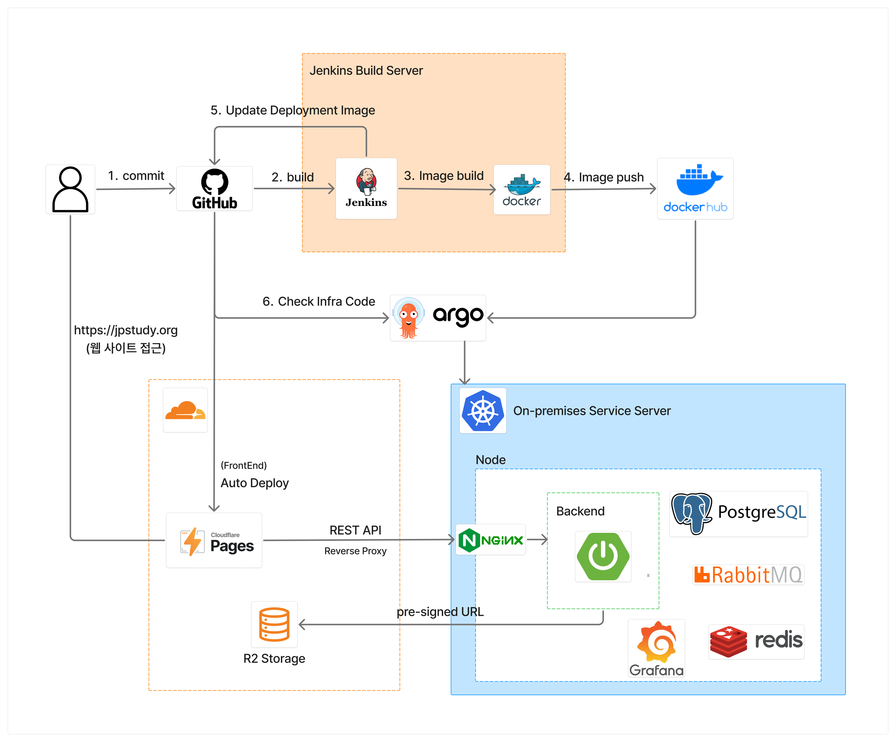

# 📚 JPStudy
## 🚀 About Us
개인적인 일본어 학습 효율을 높이기 위해 만든 사이드 프로젝트입니다.
학습 과정에서 필요하다고 느낀 기능들을 웹 기반으로 구현하며 발전시키고 있습니다.

## 📂 Projects
- [**jpstudy-backend**](https://github.com/jpstudy-org/jpstudy-backend) - 서비스 메인 백엔드 API 서버
    - REST API 기반 서비스 주요 기능들을 제공합니다.
    - 데이터 수집 및 처리 로직도 포함된 메인 백엔드 서버입니다
- [**infra**](https://github.com/jpstudy-org/infra) - 서비스 배포 및 인프라 구성을 관리하는 저장소
    - 배포 자동화를 위한 구성이 설정되어 있습니다.
    - 중요한 변수는 sealed_secret으로 관리합니다.
- [**FrontEnd**](https://github.com/jpstudy-org/web-client) - 사용자 페이지 서버
    - 완전히 AI로 제작되어, API를 제외한 나머지에 대한 안정성을 검증하지 못합니다.
    - 향후 재개발 대상이며, 현재는 백엔드 우선 순위가 높아 UX/UI 측면은 고려하지 않습니다.
- [**AdminFront**](https://github.com/jpstudy-org/web-admin) - 관리자 페이지 서버
    - 위와 동일하게 AI로 제작되었으며, 안정성 검증하지 않음
    - 향후 재개발 대상이며, 현재는 우선 순위 낮음
> ⚠️ 현재 소스코드는 공유되지 않습니다.

## 🛠 Tech Stack

- FrontEnd: React, Next.js
- BackEnd: Spring Boot
- Database: PostgreSQL, Redis, RabbitMQ
- Infra: On-Premise, K3S, Cloudflare Pages
- Development Tools: Swagger, Jenkins, ArgoCD, K6, Figma
- Monitoring: Grafana, Prometheus
- AI: FrontEnd(GPT-5, GPT-mini), Support(Gemini-3)

## 🤝 Contribution Guide
- 언제든지 편하게 `issue`에 의견을 올려주세요!
- 서비스 의견을 공유하는 것도 기여입니다
- 추가되거나 수정되어야하는 기능을 PR로 기여하실 수 있습니다

## 🗺 Roadmap
- [여기](https://github.com/jpstudy-org/.github)에서 패치노트 및 개발 방향을 확인할 수 있습니다.

## 📫 Contact
- 현재 운영 궤도에 오르지 않아 문의, 협업 제안은 받지 않습니다.
- 다만, 프로젝트 관련 버그 제보나 개선 의견은 Github Issue를 통해 남겨주실 수 있습니다.

## ✨ Other
- 성능 개선 관련 상세한 내용은 [블로그](https://devlog.jpstudy.org)에 정리되어 있습니다.
