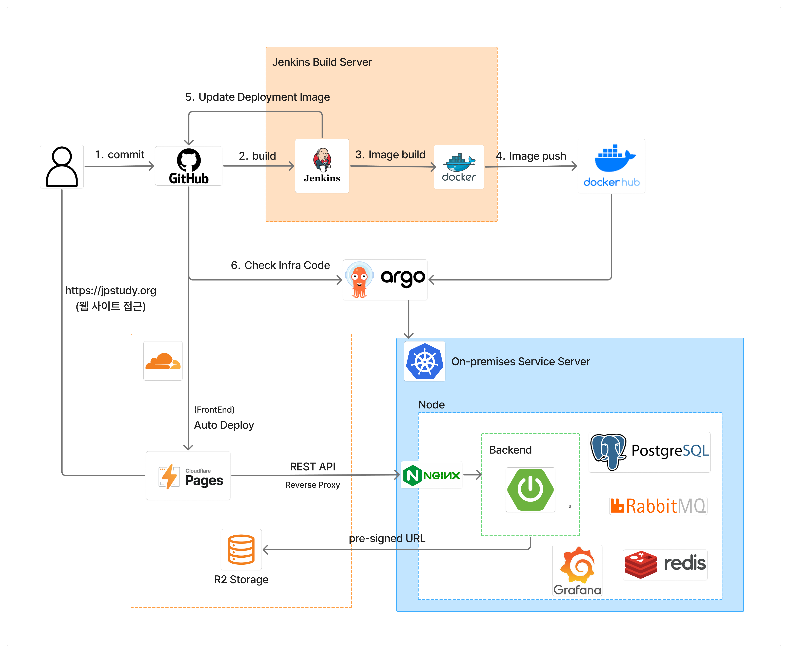

# 📚 JPStudy
## 🚀 About Us
일본어 학습 효율을 높이기 위해 만든 사이드 프로젝트
학습 과정에서 필요하다고 느낀 기능들을 웹 기반으로 개발했으며, 현재는 운영하지 않음

## 📂 Projects
- [**jpstudy-backend**](https://github.com/jpstudy-org/jpstudy-backend) - 서비스 메인 백엔드 API 서버
    - REST API 기반 서비스 주요 기능들을 제공
    - 데이터 수집 및 처리 로직도 포함된 메인 백엔드 서버
- [**infra**](https://github.com/jpstudy-org/infra) - 서비스 배포 및 인프라 구성을 관리하는 저장소
    - 배포 자동화를 위한 구성이 설정되어 있음
    - 중요한 변수는 sealed_secret으로 관리
- [**FrontEnd**](https://github.com/jpstudy-org/web-client) - 사용자 페이지 서버
    - 완전히 AI로 제작되어, API를 제외한 나머지에 대한 안정성을 검증 불가
- [**AdminFront**](https://github.com/jpstudy-org/web-admin) - 관리자 페이지 서버
    - 완전히 AI로 제작되어, API를 제외한 나머지에 대한 안정성을 검증 불가

## 🛠 Tech Stack

- FrontEnd: React, Next.js
- BackEnd: Spring Boot
- Database: PostgreSQL, Redis, RabbitMQ
- Infra: On-Premise, K3S, Cloudflare Pages
- Development Tools: Swagger, Jenkins, ArgoCD, K6, Figma
- Monitoring: Grafana, Prometheus
- AI: FrontEnd(GPT-5, GPT-mini), Support(Gemini-3)
